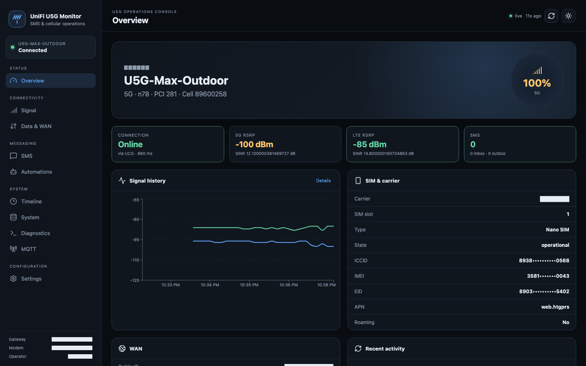
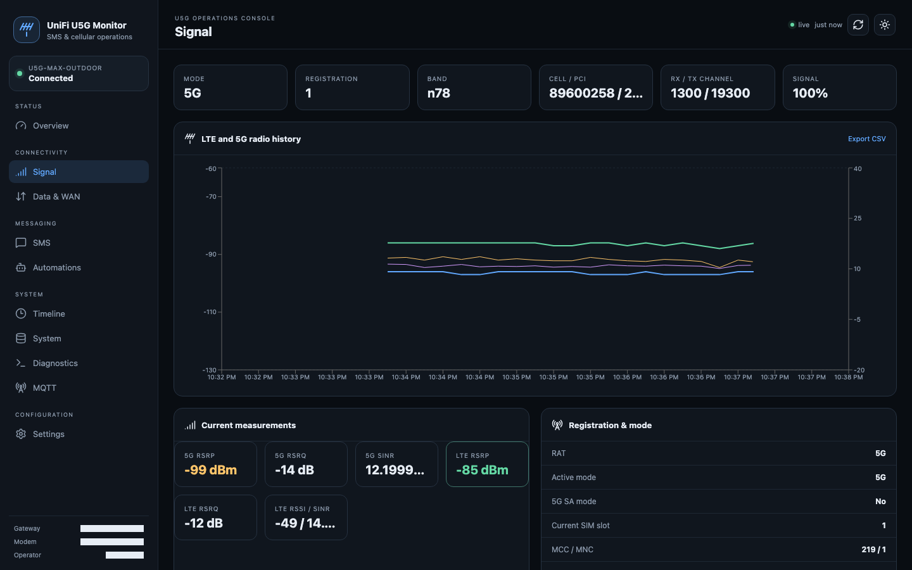
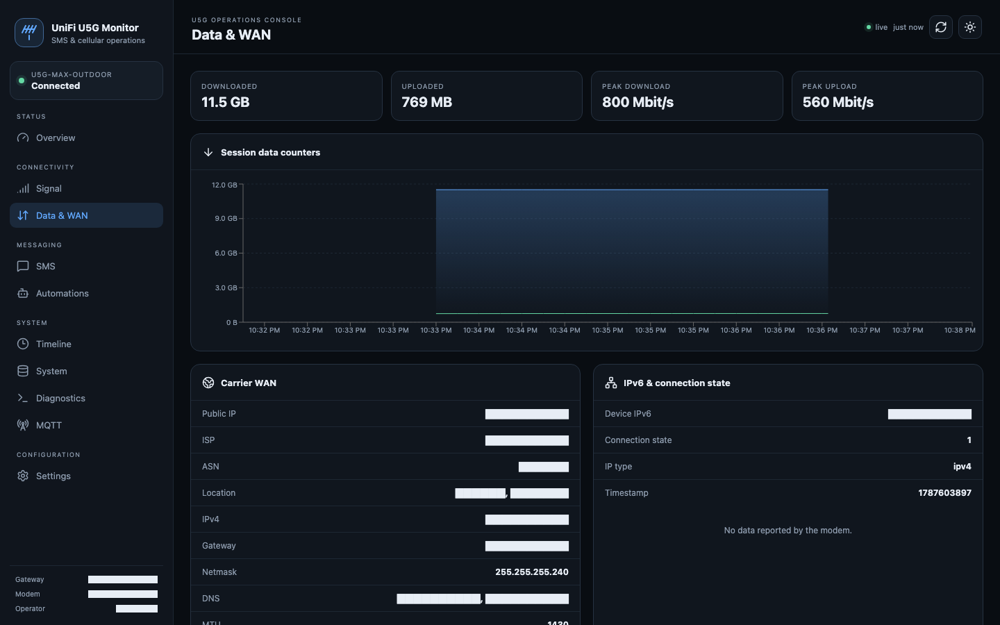

# UniFi U5G Monitor

[](https://github.com/Kajkac/unifi-u5g-monitor/actions/workflows/ci.yml)
[](LICENSE)

A private, self-hosted dashboard for the UniFi U5G family of mobile gateways (U5G, U5G Max, U5G Max Outdoor). It reaches the modem through the UniFi gateway as an SSH jump host, reads real device state via `mca-dump`, and uses the U5G's built-in `read-sms` / `send-sms` commands — features the stock UniFi web UI doesn't expose.

This is not affiliated with or endorsed by Ubiquiti/UniFi. It talks to your own hardware over SSH on your own network.

<p align="center">
  
  
  
</p>

*Identifying values (IPs, MAC, serial, carrier, location) are redacted in these screenshots; nothing like that is shown to other users of your own instance.*

## Supported hardware

- UniFi U5G
- UniFi U5G Max
- UniFi U5G Max Outdoor

**Prerequisite:** a UniFi gateway (e.g. Cloud Gateway, UDM/UDM Pro/UDM SE, UDR, UXG) that has adopted the U5G in the UniFi Network application. The U5G is not reached directly — this app SSHes into the gateway first and jumps from there to the modem, the same path the UniFi controller itself uses to manage it.

## Features

- Device overview: model, firmware, uptime, CPU, memory, Ethernet link
- LTE/5G signal: carrier aggregation, cell, PCI, bands, RSRP/RSRQ/SNR
- SIM, APN, WAN status, data usage, and public IP geolocation
- Persistent SMS Inbox/Outbox in SQLite, unread status, templates, and sending
- Safe SMS automations with cooldown, daily limit, and an allowlist of actions
- Timeline / measurement history, MQTT, and Home Assistant discovery
- ntfy, Telegram, and email notifications
- Admin/viewer login and a redacted backup export (no secrets included)
- Built-in update checker (Settings > About): periodic + manual check against GitHub, changelog view, one-click update on git-based installs

## Architecture

```text
Browser -> local app :8513
                |
                v
          SSH to UniFi gateway
                |
                v
          SSH jump -> U5G modem
```

- **Local**: run the app on a machine that can SSH to the gateway (e.g. your home server or a Mac on the LAN).
- **Remote access**: use a VPN / Teleport / WireGuard tunnel into the home network, then open the app. Do not expose port 8513 or SSH directly to the internet without a reverse proxy, HTTPS, and strong authentication.
- The UniFi cloud login only authenticates the official UniFi console — it has no bearing on this app. This app still needs its own network path to the gateway/modem.

## Requirements

- Node.js 22+
- Network/SSH access to your UniFi gateway (which in turn reaches the U5G modem)

## Quick start (all platforms)

```bash
git clone https://github.com/Kajkac/unifi-u5g-monitor.git
cd unifi-u5g-monitor
npm install
npm run build
npm run server
```

Open `http://127.0.0.1:8513`. On first run you'll see a **setup screen** asking for your UniFi gateway IP, its SSH password, and a new admin password — fill it in and you're done. (You can skip it and use the default `admin` / `admin` login instead, but change that password before exposing the app to anything beyond localhost.)

Then go to **Settings > Connection** to fine-tune the U5G modem's IP and credentials. The recommended **UniFi managed credentials** mode fetches the adopted U5G SSH credentials from the UniFi Network controller into memory only — the modem doesn't need to be directly reachable from the machine running this app.

## Running on macOS / Linux

```bash
npm install
npm run build
npm run server
```

To keep it running in the background on Linux, use the provided systemd unit as a template:

```bash
cp scripts/unifi-u5g-monitor.service ~/.config/systemd/user/
systemctl --user daemon-reload
systemctl --user enable --now unifi-u5g-monitor
```

Edit `WorkingDirectory` in the unit file if you didn't clone into `~/unifi-u5g-monitor`.

On macOS you can use the same systemd-style approach with `launchd`, or simply run `npm run server` inside a `tmux`/`screen` session or process manager (e.g. `pm2`).

## Running on Windows

```powershell
npm install
npm run build
npm run server
```

Or use the included PowerShell helper:

```powershell
scripts\start-local.ps1
```

To install it as a background Windows Service (auto-start on boot):

```powershell
npm run service:install
```

Remove it with:

```powershell
npm run service:uninstall
```

## Running with Docker

The app also ships a `Dockerfile` and `docker-compose.yml` — this is the easiest way to run it if you don't want a local Node.js setup.

```bash
git clone https://github.com/Kajkac/unifi-u5g-monitor.git
cd unifi-u5g-monitor
docker compose up -d --build
```

Open `http://127.0.0.1:8513`. Configuration (`config/settings.json`) and the SQLite database (`data/`) are bind-mounted from the project directory, so they persist across container rebuilds/restarts.

Without Compose:

```bash
docker build -t unifi-u5g-monitor .
docker run -d --name unifi-u5g-monitor -p 8513:8513 \
  -v "$(pwd)/config:/app/config" \
  -v "$(pwd)/data:/app/data" \
  unifi-u5g-monitor
```

The container binds to `0.0.0.0:8513` internally (via the `U5G_HOST` env var) so `-p` port mapping works out of the box; this only affects the container's own listen address, not what you enter in Settings > Connection for the gateway/modem.

### Automatic Docker updates (optional)

The Docker image itself has no `.git` checkout, so it can't self-update — the in-app "Update now" button only works for non-Docker (git-based) installs. For Docker, use `scripts/auto-update-docker.sh`: it's a no-op when already up to date, and otherwise pulls and rebuilds in place (`git pull --ff-only && docker compose up -d --build`), logging to `logs/auto-update.log`.

Schedule it periodically with cron (Linux/macOS):

```bash
crontab -e
# check every 30 minutes
*/30 * * * * /path/to/unifi-u5g-monitor/scripts/auto-update-docker.sh
```

Or with a systemd timer on Linux — create `/etc/systemd/system/u5g-monitor-update.service` and `.timer` units that run the script `OnCalendar=*:0/30`, then `systemctl enable --now u5g-monitor-update.timer`.

This is opt-in and off by default — without it, you'll just get an in-app notification and update on your own schedule.

## Configuration and data

- Runtime configuration: `config/settings.json` (git-ignored, generated on first run from `config/settings.example.json` defaults)
- Database: `data/u5g-monitor.sqlite` (git-ignored)
- SSH passwords stay local; UniFi managed modem credentials are never written to the app database
- Diagnostics and backups mask IMEI/ICCID/EID and never return configured secrets
- An SMS send that times out is marked `unknown` instead of being retried, to avoid duplicate sends

## Development

```bash
npm run dev     # API + Vite dev server together
npm run lint
npm run build
```

The Vite dev UI runs on `127.0.0.1:5173` and proxies API/WebSocket traffic to port 8513.

## Security notes before you deploy

- Change the default `admin`/`admin` password immediately.
- Never expose port 8513 (or SSH) directly to the public internet — put it behind a VPN or an authenticated reverse proxy with HTTPS.
- `config/settings.json` and `data/` contain credentials and message history — they are git-ignored by default; keep it that way.

## License

MIT — see [LICENSE](LICENSE).
